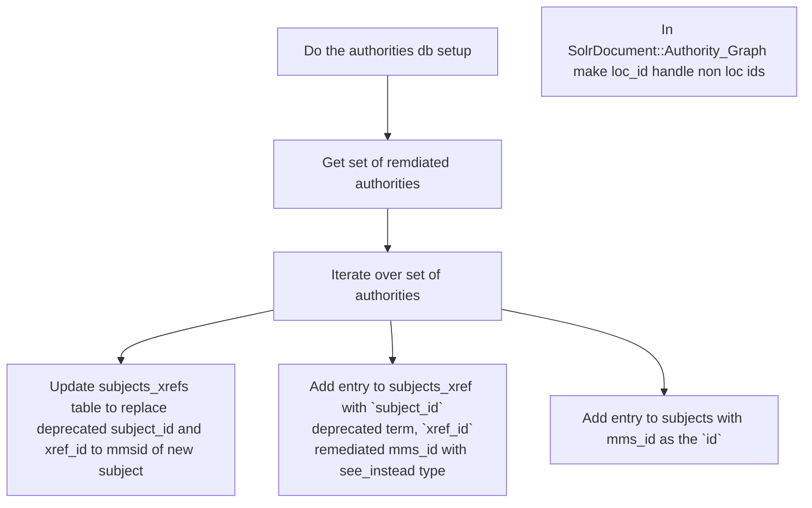

```mermaid
flowchart TD
A[Do the authorities db setup] --> B[Get set of remdiated authorities]
B --> C[Iterate over set of authorities]
C --> D[Update subjects_xrefs table to replace \ndeprecated subject_id and xref_id to mmsid of new subject]
C --> E[Add entry to subjects_xref with `subject_id`\n deprecated term, `xref_id` remediated mms_id with see_instead type]
C --> F[Add entry to subjects with mms_id as the `id` ]

G[In SolrDocument::Authority_Graph make loc_id handle non loc ids]
```
