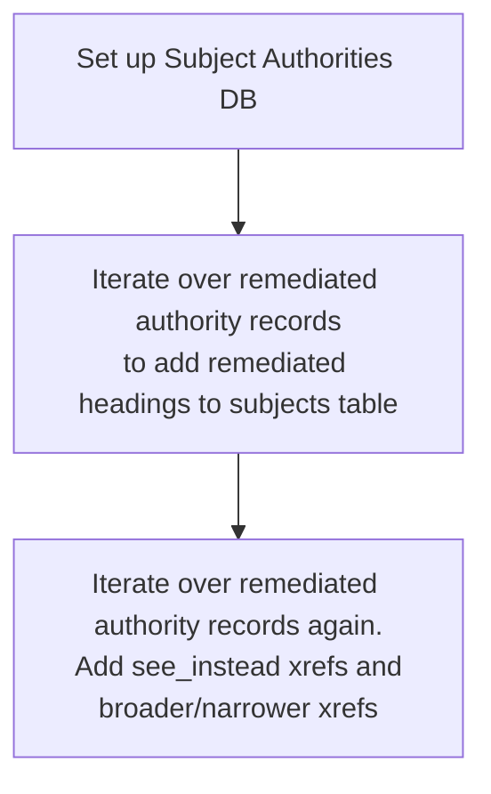

```mermaid
flowchart TD
    A[Set up Subject Authorities DB] --> B[Iterate over remediated authority records\nto add remediated headings to subjects table]
    B --> C[Iterate over remediated authority records again.\n Add see_instead xrefs and broader/narrower xrefs]
```
